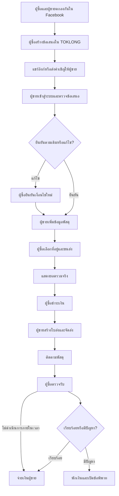
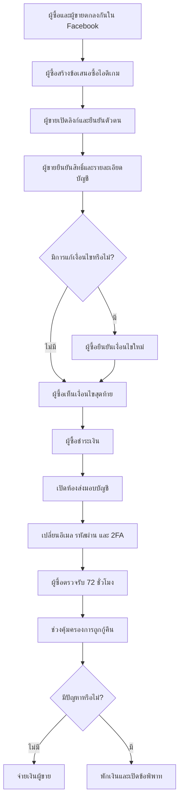

# TOKLONG — Buyer-Initiated Private Deal Flow

**เวอร์ชัน:** 2 สิงหาคม 2026

**ขอบเขต:** ดีลส่วนตัวที่ผู้ซื้อและผู้ขายตกลงกันจาก Facebook, LINE, Messenger, Discord หรือช่องทางอื่นก่อนเข้ามาใช้ TOKLONG

---

## 1. นิยามผลิตภัณฑ์ที่ถูกต้อง

TOKLONG **ไม่ใช่ Marketplace และไม่มีหน้ารวมรายการสินค้า** ผู้ใช้ไม่ได้เข้ามาค้นหา เลือกสินค้า ใส่ตะกร้า หรือกดซื้อจากประกาศสาธารณะ

รูปแบบจริงคือ:

1. ผู้ซื้อพบผู้ขายจากกลุ่ม Facebook หรือช่องทางภายนอก
2. ทั้งสองฝ่ายพูดคุยและตกลงราคาเบื้องต้น
3. ผู้ซื้อสร้างข้อเสนอส่วนตัวใน TOKLONG
4. ผู้ขายเปิดข้อเสนอ ตรวจรายละเอียด และกดยืนยันหรือแก้ไข
5. ผู้ซื้อเห็นเงื่อนไขสุดท้ายแล้วจึงชำระเงิน
6. TOKLONG ดูแลการถือเงิน หลักฐาน การจัดส่งหรือส่งมอบ การตรวจรับ ข้อพิพาท และการจ่ายเงินผู้ขาย

ดังนั้นแกนของผลิตภัณฑ์ควรเป็น:

> **คุยกันข้างนอก → สร้างดีลใน TOKLONG → ผู้ขายยืนยัน → ผู้ซื้อจ่าย → ส่งมอบ → ตรวจรับ → จ่ายเงินผู้ขาย**

---

## 2. กฎหลักของ Flow

1. **ผู้ซื้อเป็นผู้เริ่มดีล** เพราะเป็นคนต้องการใช้ความคุ้มครอง
2. **ผู้ซื้อสร้าง “ร่างจากสิ่งที่ตกลงกัน”** ไม่ได้เป็นผู้รับรองว่าสินค้านั้นมีอยู่จริง
3. **ผู้ขายเป็นผู้ยืนยันข้อมูลที่ตนรับผิดชอบ** เช่น สภาพจริง ตำหนิ สิ่งที่รวม ขนาดพัสดุ หรือสิทธิ์ในการโอนไอดีเกม
4. **ยังห้ามชำระเงินก่อนผู้ขายยืนยัน**
5. หากผู้ขายแก้ไขข้อมูลสำคัญ เช่น ราคา สภาพ ตำหนิ สิ่งที่รวม หรือระยะคุ้มครอง ผู้ซื้อต้องยืนยันเงื่อนไขใหม่ก่อนจ่าย
6. ทุกสถานะควรมี **ปุ่มหลักเพียงหนึ่งปุ่ม** เพื่อให้ผู้ใช้รู้ทันทีว่าต้องทำอะไรต่อ
7. TOKLONG ต้องเก็บหลักฐานที่จำเป็นไว้ในระบบ ไม่พึ่ง Screenshot จากแชตภายนอกเพียงอย่างเดียว

---

# 3. Flow สำหรับสินค้าที่จัดส่ง

## ภาพรวม

## 3.1 ก่อนเข้า TOKLONG

ผู้ซื้อและผู้ขายตกลงกันใน Facebook หรือช่องทางอื่นเกี่ยวกับ:

- สินค้าอะไร
- ราคาเท่าไร
- สภาพโดยรวม
- สิ่งที่รวม
- ใครออกค่าจัดส่ง ถ้ามีการตกลงไว้

TOKLONG ไม่ต้องดึงแชตทั้งหมดเข้ามาเป็นเงื่อนไขโดยอัตโนมัติ ผู้ใช้สามารถแนบ Screenshot หรือใช้ตัวช่วยสรุปจากข้อความได้ แต่ต้องตรวจและยืนยันร่างก่อนส่ง

## 3.2 ผู้ซื้อสร้างข้อเสนอ

หน้าแรกใช้ปุ่มหลัก:

> **สร้างดีลซื้อ**

จากนั้นเลือก:

> **สินค้าที่จัดส่ง**

ผู้ซื้อกรอกเฉพาะข้อมูลเบื้องต้น:

- ชื่อสินค้า
- ราคาที่ตกลง
- รูปหรือ Screenshot จากโพสต์/แชต
- สภาพตามที่ผู้ขายแจ้ง
- ตำหนิที่รับทราบ
- สิ่งที่ควรได้รับ
- หมายเหตุจากข้อตกลง

### วิธีเชิญผู้ขาย

ควรมีสองวิธี:

1. **แชร์ลิงก์กลับไปในแชต Facebook** — เป็นวิธีหลักและง่ายที่สุด
2. **ระบุเบอร์โทรผู้ขาย** — เป็นตัวเลือกสำหรับล็อกดีลให้เฉพาะบัญชีที่ใช้เบอร์นั้น

ไม่ควรบังคับให้ผู้ซื้อพิมพ์ชื่อผู้ขาย เพราะชื่อและสถานะยืนยันควรมาจากบัญชีของผู้ขายเอง

## 3.3 ผู้ซื้อตรวจและส่งข้อเสนอ

ก่อนส่ง แสดง:

- สินค้า
- ราคาที่ตกลง
- สภาพและตำหนิที่ผู้ซื้อเข้าใจ
- รูปแนบ
- สิ่งที่รวม
- ข้อความว่า **ยังไม่มีการเรียกเก็บเงิน**
- ข้อความว่า **ผู้ขายต้องยืนยันและระบุข้อมูลพัสดุก่อนจึงชำระได้**

ปุ่มหลัก:

> **ส่งข้อเสนอให้ผู้ขาย**

สถานะหลังส่ง:

> **รอผู้ขายเปิดข้อเสนอ**

## 3.4 ผู้ขายเปิดและยืนยันข้อเสนอ

ผู้ขายเปิดลิงก์แล้วเข้าสู่ระบบด้วยเบอร์โทรและ OTP

ระบบต้องแสดงให้ผู้ขายตรวจทีละส่วน:

- ชื่อสินค้า
- ราคา
- สภาพจริง
- ตำหนิ
- สิ่งที่รวม
- รูปสินค้าจริง

ผู้ขายเลือกได้:

- **ยืนยันตามข้อเสนอ**
- **แก้ไขและส่งกลับให้ผู้ซื้อ**
- **ปฏิเสธดีล**

### ข้อมูลที่ผู้ขายต้องเพิ่ม

- รูปสินค้าจริงอย่างน้อย 1 รูป
- รูปตำหนิ หากมีตำหนิ
- ที่อยู่ต้นทางที่บันทึกไว้
- ประเภทพัสดุ: ซอง / กล่องเล็ก / กล่องกลาง / กล่องใหญ่ / ระบุเอง
- น้ำหนักโดยประมาณ
- วันสุดท้ายที่สามารถจัดส่งได้

ผู้ขายไม่ต้องพิมพ์ค่าส่งเอง ระบบคำนวณจากข้อมูลพัสดุและปลายทางผู้ซื้อ

## 3.5 กรณีผู้ขายแก้ข้อมูล

ข้อมูลต่อไปนี้ถือเป็น **การเปลี่ยนเงื่อนไขสำคัญ**:

- ราคา
- สภาพ
- ตำหนิ
- สิ่งที่รวม
- รุ่นหรือสินค้า
- ผู้รับผิดชอบค่าส่ง

เมื่อมีการแก้ ระบบเปลี่ยนสถานะเป็น:

> **ผู้ขายแก้ไขข้อเสนอ — รอผู้ซื้อยืนยัน**

ผู้ซื้อเห็นความแตกต่างแบบ Before/After และกด:

- **ยอมรับเงื่อนไขใหม่**
- **ยกเลิกดีล**

## 3.6 ผู้ซื้อเลือกที่อยู่และชำระเงิน

ที่อยู่ผู้ซื้อควรถูกถาม **หลังผู้ขายยืนยันแล้ว** ไม่ใช่ก่อนหน้า เพราะ:

- ลดขั้นตอนตอนสร้างดีล
- ไม่ต้องกรอกที่อยู่สำหรับดีลที่อาจถูกปฏิเสธ
- ค่าส่งคำนวณได้เมื่อข้อมูลพัสดุพร้อมแล้ว

ผู้ซื้อเลือก:

- ที่อยู่จัดส่ง
- บริการขนส่ง
- ประกันขนส่งเพิ่มเติม ถ้ามี

หน้า Checkout แสดง:

- ราคาสินค้า
- ค่าจัดส่ง
- ค่าคุ้มครอง TOKLONG
- ประกันขนส่งเพิ่มเติม
- ยอดรวมทั้งหมด

ปุ่มหลัก:

> **ชำระ ฿X,XXX**

## 3.7 ผู้ขายจัดส่ง

หลังชำระสำเร็จ ผู้ขายได้รับสถานะ:

> **ผู้ซื้อชำระแล้ว — กรุณาจัดส่งภายในวันที่ …**

ปุ่มหลัก:

> **สร้างใบจัดส่ง**

ระบบ SHIPPOP ควรสร้าง:

- Label
- Tracking
- จุด Drop-off
- ตัวเลือกเรียกรถรับ

สำหรับสินค้าราคาสูง อาจบังคับให้ผู้ขายถ่าย:

- รูปสินค้าก่อนแพ็ก
- รูปสินค้าภายในกล่อง
- รูปกล่องหลังปิดผนึก

## 3.8 ผู้ซื้อตรวจรับ

เมื่อ Tracking ขึ้นว่าส่งถึง ระบบเริ่มช่วงตรวจรับ เช่น 48–72 ชั่วโมง

แสดงสองปุ่ม:

- **ได้รับแล้ว สินค้าเรียบร้อย**
- **มีปัญหากับสินค้า**

กรณีผู้ซื้อไม่ดำเนินการภายในเวลาที่กำหนดและไม่มีข้อพิพาท ระบบจบดีลอัตโนมัติ

## 3.9 การจ่ายเงินผู้ขาย

- ผู้ซื้อกดยืนยันเรียบร้อย → เริ่มจ่ายเงินผู้ขาย
- ครบเวลาตรวจรับโดยไม่มีปัญหา → Auto-release
- มีข้อพิพาท → พักเงินจนกว่าจะมีผลพิจารณา

---

# 4. Flow สำหรับไอดีเกม

## ภาพรวม

## 4.1 ผู้ซื้อสร้างข้อเสนอเบื้องต้น

ผู้ซื้อเลือก:

> **ไอดีเกม**

ไม่ควรรวมคำว่า “ไอดีเกม / ดิจิทัล” ไว้หมวดเดียว เพราะคีย์เกม Gift Card ไอเทม เงินในเกม และบัญชีเกมมีวิธีส่งมอบคนละแบบ

ผู้ซื้อกรอก:

- ชื่อเกม
- แพลตฟอร์ม
- เซิร์ฟเวอร์หรือ Region
- ราคา
- รายละเอียดที่ตกลงจากแชต
- Rank, Level, ตัวละคร หรือไอเทมสำคัญที่ผู้ขายกล่าวอ้าง
- Screenshot ประกอบ

ข้อมูลนี้เป็นเพียง **ร่างจากสิ่งที่ผู้ซื้อเข้าใจ** และยังไม่ถือว่าผู้ขายรับรอง

## 4.2 ผู้ขายยืนยันตัวตนและสิทธิ์

ก่อนรับดีลไอดีเกม ผู้ขายควรผ่าน:

- ยืนยันเบอร์โทร
- ยืนยันตัวตนตามระดับความเสี่ยง
- ยืนยันบัญชีธนาคาร
- ยอมรับกฎเฉพาะการขายไอดีเกม

ผู้ขายต้องยืนยันว่า:

- เป็นเจ้าของหรือมีสิทธิ์โอนจริง
- บัญชีเป็น Full Access
- มีอีเมลต้นทางหรือข้อมูลกู้คืนที่จำเป็น
- เปลี่ยนอีเมลได้หรือไม่
- ถอดเบอร์และ 2FA เดิมได้หรือไม่
- ถอดบัญชีเชื่อม เช่น Google, Apple, Facebook, Steam, PSN หรือ Xbox ได้หรือไม่
- มีประวัติ Ban, Suspension หรือข้อจำกัดหรือไม่
- เคยขายหรือโอนให้บุคคลอื่นมาก่อนหรือไม่

บัญชีที่ไม่มีสิทธิ์ควบคุมครบ ไม่ควรผ่าน เช่น:

- NFA
- บัญชีแชร์
- บัญชีเช่า
- Offline account
- บัญชีที่ถอดข้อมูลผู้ขายเดิมไม่ได้
- บัญชีที่แหล่งที่มาไม่ชัดเจน

## 4.3 ผู้ขายยืนยันรายละเอียดบัญชี

ผู้ขายต้องตรวจและยืนยันข้อมูล:

- เกม แพลตฟอร์ม เซิร์ฟเวอร์ และ Region
- Rank และ Level
- ตัวละคร Skin หรือ Inventory สำคัญ
- สิ่งที่รวมและไม่รวม
- เปลี่ยนชื่อได้หรือไม่
- ข้อจำกัดในการโอน
- ระยะเวลาส่งมอบ
- ระยะคุ้มครองหลังส่งมอบ

รูปหลักฐานจากผู้ขายควรเป็นข้อมูลบังคับ เช่น:

- หน้า Profile
- หน้า Rank/Level
- Inventory หรือ Skin สำคัญ
- หน้า Server/Region
- หน้าสถานะบัญชีที่เชื่อม โดยปิดข้อมูลลับ

ระบบควรใส่ Watermark พร้อมเลขดีลและวันที่ลงบนรูปหลักฐาน

## 4.4 ผู้ขายยืนยันหรือแก้ข้อเสนอ

ผู้ขายเลือก:

- **ยืนยันและรับข้อเสนอ**
- **แก้ไขข้อมูลแล้วส่งให้ผู้ซื้อยืนยันใหม่**
- **ปฏิเสธดีล**

หากราคา รายการไอเทม Rank สิทธิ์การกู้คืน หรือระยะคุ้มครองเปลี่ยน ผู้ซื้อต้องกดยอมรับใหม่ก่อนชำระ

## 4.5 ผู้ซื้อเห็นเงื่อนไขสุดท้ายและชำระ

ก่อนจ่าย ผู้ซื้อควรเห็น:

- ข้อมูลบัญชีฉบับที่ผู้ขายยืนยันแล้ว
- สถานะยืนยันตัวตนผู้ขาย
- รูปหลักฐาน
- Full Access หรือไม่
- บัญชีที่ยังเชื่อมอยู่
- ประวัติ Ban หรือข้อจำกัด
- วิธีส่งมอบ
- ช่วงตรวจรับ
- ช่วงคุ้มครองการถูกกู้คืน
- ค่าคุ้มครองและยอดรวม
- วันที่โดยประมาณที่ผู้ขายจะได้รับเงิน

ปุ่มหลัก:

> **ชำระและเริ่มการส่งมอบ**

## 4.6 ห้องส่งมอบบัญชี

ไม่ควรใช้ข้อความว่า “ผู้ขายส่งข้อมูลผ่านช่องทางภายนอกที่ตกลงกัน” เป็นวิธีหลัก เพราะ TOKLONG จะพิสูจน์ไม่ได้ว่าส่งอะไร เมื่อไร และครบหรือไม่

ควรมีหน้า:

> **ห้องส่งมอบบัญชี**

### วิธีที่แนะนำ

1. ผู้ซื้อระบุอีเมลใหม่สำหรับรับบัญชี
2. ผู้ขายเปลี่ยนอีเมลของบัญชีเป็นอีเมลผู้ซื้อ
3. ผู้ซื้อยืนยันอีเมล
4. ผู้ซื้อเปลี่ยนรหัสผ่าน
5. ผู้ซื้อเปิด 2FA ของตนเอง
6. ผู้ขายออกจากระบบและถอดอุปกรณ์ของตน
7. ระบบบันทึกเวลาและผู้กดแต่ละขั้น

ห้ามส่งข้อมูลต่อไปนี้ใน Chat ปกติ:

- Password
- OTP
- Recovery Code
- Secret Answer
- Backup Key

หากบางเกมจำเป็นต้องส่ง Credentials ระบบต้องใช้ช่องข้อมูลลับที่เข้ารหัส ไม่แสดงใน Notification และลบหลังจบดีลตามนโยบาย

## 4.7 ผู้ซื้อตรวจรับบัญชี

ผู้ซื้อทำ Checklist:

- เข้าบัญชีได้
- เกมและเซิร์ฟเวอร์ถูกต้อง
- Rank, Level, Skin และ Inventory ตรงตามข้อเสนอ
- เปลี่ยนอีเมลแล้ว
- เปลี่ยนรหัสผ่านแล้ว
- ตั้ง 2FA แล้ว
- ถอดเบอร์หรืออีเมลผู้ขายแล้ว
- Logout อุปกรณ์เดิมแล้ว
- ไม่มีข้อจำกัดที่ไม่ได้เปิดเผย

ปุ่มหลัก:

- **ได้รับบัญชีครบและถูกต้อง**
- **มีปัญหาในการรับบัญชี**

ช่วงตรวจรับเบื้องต้นควรมีเวลาชัดเจน เช่น 72 ชั่วโมง

## 4.8 ช่วงคุ้มครองการถูกกู้คืน

หลังตรวจรับผ่าน ควรมีช่วงคุ้มครองเพิ่มเติมก่อนเงินพร้อมถอน เช่น:

- บัญชีทั่วไป: 7 วัน
- ผู้ขายใหม่ บัญชีราคาสูง หรือเกมเสี่ยงสูง: 14 วัน

ในช่วงนี้ผู้ขายเห็น:

> **ยอดรอดำเนินการ — พร้อมถอนประมาณวันที่ …**

ไม่ควรใช้สถานะ “รออนุมัติ” แบบไม่มีกำหนด

## 4.9 ข้อพิพาทไอดีเกม

### ควรคุ้มครอง

- เข้าบัญชีไม่ได้ตั้งแต่ส่งมอบ
- รายละเอียดไม่ตรงข้อเสนอ
- Rank, Item, Skin หรือ Server ไม่ตรง
- เปลี่ยนอีเมลหรือรหัสผ่านไม่ได้ตามที่ระบุ
- ผู้ขายให้ข้อมูลกู้คืนไม่ครบ
- ผู้ขายกู้บัญชีกลับ
- บัญชีมี Ban หรือข้อจำกัดเดิมที่ไม่ได้เปิดเผย

### ไม่ควรคุ้มครอง

- ผู้ซื้อลืมรหัสผ่านที่ตั้งเอง
- ผู้ซื้อส่งข้อมูลให้บุคคลอื่น
- ผู้ซื้อใช้โปรแกรมโกงแล้วถูกแบน
- ผู้ซื้อทำ Chargeback หรือกระทำผิดกฎเกมเอง
- ปัญหาหลังหมดระยะคุ้มครองที่ไม่เกี่ยวกับผู้ขาย

---

# 5. สถานะดีลที่ควรใช้

## สินค้าที่จัดส่ง

| สถานะ | ผู้ที่ต้องทำ | ปุ่มหลัก |
|---|---|---|
| รอผู้ขายเปิดข้อเสนอ | ผู้ซื้อ | แชร์ลิงก์อีกครั้ง |
| รอผู้ขายยืนยัน | ผู้ขาย | ตรวจและตอบรับ |
| ผู้ขายแก้ไขข้อเสนอ | ผู้ซื้อ | ตรวจเงื่อนไขใหม่ |
| พร้อมชำระ | ผู้ซื้อ | ชำระเงิน |
| ชำระแล้ว | ผู้ขาย | สร้างใบจัดส่ง |
| กำลังจัดส่ง | ทั้งสองฝ่าย | ติดตามพัสดุ |
| รอตรวจรับ | ผู้ซื้อ | ตรวจรับสินค้า |
| กำลังพิจารณาปัญหา | ทั้งสองฝ่าย | ส่งหลักฐาน |
| กำลังจ่ายเงิน | ผู้ขาย | ดูสถานะเงิน |
| เสร็จสิ้น | ทั้งสองฝ่าย | ดูรายละเอียด |

## ไอดีเกม

| สถานะ | ผู้ที่ต้องทำ | ปุ่มหลัก |
|---|---|---|
| รอผู้ขายเปิดข้อเสนอ | ผู้ซื้อ | แชร์ลิงก์อีกครั้ง |
| รอผู้ขายยืนยันสิทธิ์ | ผู้ขาย | ตรวจและยืนยันบัญชี |
| ผู้ขายแก้ไขข้อเสนอ | ผู้ซื้อ | ตรวจเงื่อนไขใหม่ |
| พร้อมชำระ | ผู้ซื้อ | ชำระเงิน |
| รอส่งมอบบัญชี | ผู้ขาย | เริ่มส่งมอบ |
| กำลังเปลี่ยนสิทธิ์ | ทั้งสองฝ่าย | ทำขั้นตอนถัดไป |
| รอตรวจรับ | ผู้ซื้อ | ตรวจบัญชี |
| อยู่ในช่วงคุ้มครอง | ทั้งสองฝ่าย | ดูเวลาคงเหลือ |
| กำลังพิจารณาปัญหา | ทั้งสองฝ่าย | ส่งหลักฐาน |
| กำลังจ่ายเงิน | ผู้ขาย | ดูสถานะเงิน |
| เสร็จสิ้น | ทั้งสองฝ่าย | ดูรายละเอียด |

---

# 6. สิ่งที่ต้องปรับจาก Mockup ปัจจุบัน

## 6.1 หน้าเลือกประเภท

เปลี่ยนหัวข้อจาก:

> เลือกประเภทสินค้า

เป็น:

> **คุณตกลงซื้ออะไร?**

การ์ดควรเป็น:

- **สินค้าที่จัดส่ง** — สินค้าที่ส่งผ่านบริษัทขนส่ง
- **ไอดีเกม** — บัญชีเกมที่ TOKLONG รองรับและโอนได้

ไม่ควรรวมสินค้าดิจิทัลทุกประเภทไว้กับไอดีเกมใน MVP

## 6.2 ขั้นตอนฝั่งผู้ซื้อก่อนส่งข้อเสนอ

ลดจาก 3 ขั้นเหลือ 2 ขั้น:

1. **รายละเอียดที่ตกลงกัน**
2. **ตรวจและส่งให้ผู้ขาย**

ย้าย “ที่อยู่จัดส่ง” ไปหลังผู้ขายตอบรับและระบุพัสดุแล้ว

## 6.3 เบอร์โทรผู้ขาย

- ใช้ลิงก์แชร์เป็นวิธีหลัก
- เบอร์โทรเป็นตัวเลือก “ล็อกให้เฉพาะผู้ขายคนนี้”
- ไม่ให้ผู้ซื้อพิมพ์ชื่อผู้ขาย
- ชื่อและสถานะยืนยันมาจากบัญชีผู้ขายหลังเปิดลิงก์

## 6.4 รูปสินค้า

- ฝั่งผู้ซื้อ: แนบรูปหรือ Screenshot ได้ แต่ไม่จำเป็นต้องเป็นหลักฐานสุดท้าย
- ฝั่งผู้ขายสินค้าจัดส่ง: ต้องยืนยันและเพิ่มรูปสินค้าจริง
- ฝั่งผู้ขายไอดีเกม: ต้องเพิ่มรูปหลักฐานที่ระบบกำหนด

## 6.5 หน้าที่อยู่จัดส่ง

ไม่ควรอยู่ก่อนผู้ขายตอบรับ ให้ปรากฏเมื่อ:

- ผู้ขายยืนยันดีลแล้ว
- ผู้ขายกรอกพัสดุแล้ว
- ระบบพร้อมคำนวณค่าส่งจริง

## 6.6 หน้าสรุปก่อนส่งข้อเสนอ

ไม่ต้องแสดงยอดชำระสุดท้าย เพราะยังไม่รู้ค่าส่งและผู้ขายยังไม่ยืนยัน

ควรแสดง:

- ราคาที่ตกลง
- ค่าคุ้มครองจะคำนวณหลังผู้ขายยืนยัน
- ค่าส่งจะคำนวณหลังผู้ขายระบุพัสดุ
- ยังไม่มีการตัดเงิน

## 6.7 Flow ไอดีเกม

แก้ข้อความ:

> ผู้ขายส่งข้อมูลผ่านช่องทางภายนอกที่ตกลงกัน

เป็น:

> **ชำระแล้วจึงเริ่มส่งมอบผ่านห้องส่งมอบของ TOKLONG**

เพิ่ม Checklist การโอนสิทธิ์และหลักฐานในระบบ

## 6.8 หน้าแรกของแอป

ไม่ต้องมีหน้า Browse, Search, Category, Product Feed หรือ Cart

หน้าแรกควรมี:

1. ปุ่มใหญ่ **สร้างดีลซื้อ**
2. ช่อง **เปิดลิงก์หรือกรอกรหัสดีล**
3. ส่วน **ต้องทำตอนนี้**
4. ดีลที่กำลังดำเนินการ
5. ประวัติดีล

---

# 7. ใครรับผิดชอบข้อมูลอะไร

| ข้อมูล | ผู้รับผิดชอบหลัก |
|---|---|
| สิ่งที่ตกลงในแชต | ผู้ซื้อสร้างร่าง |
| ชื่อและตัวตนผู้ขาย | ระบบจากบัญชีผู้ขาย |
| ราคา | ผู้ซื้อกรอกร่าง ผู้ขายยืนยัน |
| สภาพและตำหนิจริง | ผู้ขายยืนยัน |
| สิ่งที่รวม | ผู้ขายยืนยัน |
| รูปสินค้าจริง | ผู้ขาย |
| ขนาดและน้ำหนักพัสดุ | ผู้ขาย |
| ที่อยู่ต้นทาง | ผู้ขาย |
| ที่อยู่ปลายทาง | ผู้ซื้อ |
| ค่าจัดส่ง | ระบบ SHIPPOP |
| ค่าคุ้มครอง | ระบบ TOKLONG |
| วิธีชำระเงิน | ผู้ซื้อ |
| Tracking | ระบบขนส่ง |
| สิทธิ์และข้อมูลโอนไอดีเกม | ผู้ขายยืนยัน |
| ผลตรวจรับ | ผู้ซื้อ |
| การจ่ายเงิน | ระบบ TOKLONG |

---

# 8. ขอบเขต MVP ที่แนะนำ

## MVP สินค้าที่จัดส่ง

- ผู้ซื้อสร้างข้อเสนอ
- แชร์ลิงก์ให้ผู้ขาย
- ผู้ขายยืนยันหรือแก้เงื่อนไข
- ผู้ขายระบุพัสดุ
- ผู้ซื้อเลือกที่อยู่และชำระ
- SHIPPOP และ Tracking
- ตรวจรับ 48–72 ชั่วโมง
- Auto-release
- ข้อพิพาทพื้นฐาน

## MVP ไอดีเกม

ไม่ควรเปิดด้วยการเปลี่ยนเพียงข้อความจาก Flow สินค้าจัดส่ง ต้องมีอย่างน้อย:

- รายชื่อเกมที่รองรับ
- การยืนยันผู้ขาย
- Full Access only
- แบบฟอร์มสิทธิ์และการกู้คืน
- รูปหลักฐานบังคับ
- ห้องส่งมอบบัญชี
- Checklist เปลี่ยนอีเมล รหัสผ่าน และ 2FA
- ช่วงตรวจรับ
- ช่วงคุ้มครองการถูกกู้คืน
- กฎข้อพิพาทเฉพาะไอดีเกม

---

# 9. สรุป Flow แบบสั้นที่สุด

## สินค้าที่จัดส่ง

> ผู้ซื้อสร้างร่างจากสิ่งที่คุยกัน → ส่งลิงก์ให้ผู้ขาย → ผู้ขายยืนยันสินค้าและพัสดุ → ผู้ซื้อเลือกที่อยู่และจ่าย → ผู้ขายส่ง → ผู้ซื้อตรวจรับ → TOKLONG จ่ายเงินผู้ขาย

## ไอดีเกม

> ผู้ซื้อสร้างร่างจากสิ่งที่คุยกัน → ผู้ขายยืนยันสิทธิ์และรายละเอียดบัญชี → ผู้ซื้อจ่าย → ส่งมอบผ่านห้องปลอดภัย → ผู้ซื้อเปลี่ยนข้อมูลความปลอดภัยและตรวจรับ → ผ่านช่วงคุ้มครอง → TOKLONG จ่ายเงินผู้ขาย

---

# 10. หลัก UX ที่ต้องรักษา

> **ผู้ซื้อกรอกให้น้อยที่สุด ผู้ขายยืนยันเฉพาะสิ่งที่ตนรู้ และทุกหน้ามีสิ่งที่ต้องทำต่อเพียงอย่างเดียว**

ผู้ใช้ไม่ควรรู้สึกว่ากำลังลงประกาศสินค้า แต่ควรรู้สึกว่า:

> **“ผมคุยกับผู้ขายเสร็จแล้ว ตอนนี้แค่สร้างดีลปลอดภัย ส่งให้เขายืนยัน แล้วจ่ายได้เลย”**
